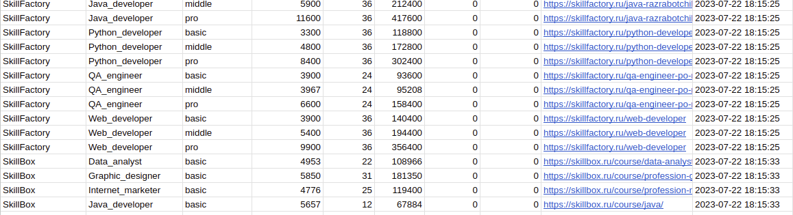
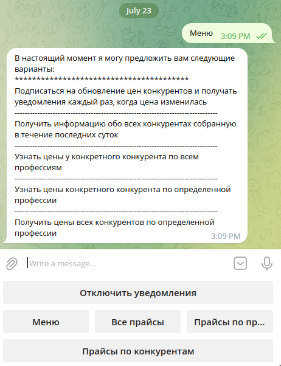
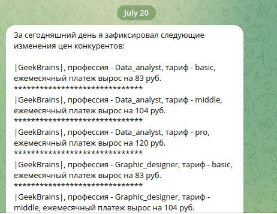
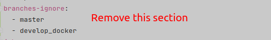

# The Sky Parser
The app allows to parse prices from five different websites such as GB, SF, Netology, etc. 
Raw parsed data will be prepared and sent to Google spreadsheet. All results also available from Telegram bot. 

The app provides functionality as follows:
 - Calculating total price from price per month and period received from websites
 - Sending prepared data such as school name, profession name, tariff plan name, price per month, payment period, 
total price, etc. to Google spreadsheet 
 - Retrieving parsed data in Telegram bot. You can retrieve data by school and profession or just all prices at 
once 
 - Saving parse tags to 10 JSON files. Thus, if you occasionally delete a spreadsheet with parse tags the app 
will be use reserved tags from last saved file 
 - Saving last parsed data into JSON file
 - Logging

How to work the app:

---

**Technologies used in the project:**
 
 - Asyncio
 - Telebot 0.0.5
 - Aiohttp 3.8.4
 - beautifulsoup4 4.11.2
 - Selenium 4.9.0
 - Gspread 5.7.2
 - Selenoid
 - Chrome 112.0
 - Docker
 - Docker-compose

---

**Project's structure:**
 
 - .github - CI/CD files for GitHub actions to deploy the app
 - auth_data - Google API auth JSON file 
 - data - JSON files with parse result, parse tags, TG bot phrases, selenoid browsers, etc.
 - log - text logger file 
 - managers - classes to parse data, receive/send data to/from Google spreadsheet, store parse tags, 
create loggers
 - container.py - instances to be imported by the another project units
 - parse_classes - Pydantic models
 - parsers - classes for all five websites with necessary logic taking into account the parsing peculiarities 
 - telegram_bot - all classes and handlers necessary for telegram bot
 - Docker-compose-ci.yaml - docker-compose template file to create a main docker-compose file
 - Dockerfile - description of the image to create a container with main app 
 - create_loggers.py - file with logger instances to import into another units
 - main.py - a main file to start the application
 - utils.py - utility functions
 - requirements.txt - project dependencies
 - README.md - this file with project description
---

**How to start the project:**
The app is ready to install out of the box by using GitHub actions. There are three containers in the 
docker - parser(main app), browser(selenoid app), telebot(TG bot app).
To start the app just follow the next steps:
 - Prepare VPS where you are going to deploy the app (I recommend to use Ubuntu. You'll need a username and 
 password)
 - Create you owr GitHub repo with secrets provided below
 - Retrieve Google auth file by this tutorial - https://dvsemenov.ru/google-tablicy-i-python-podrobnoe-rukovodstvo-s-primerami/
 - Create your Google sheet and provide write rules for email received in the previous step. You can use my
parse tags from this table https://docs.google.com/spreadsheets/d/1ZopNIBAcudJvff-svtNgyoKLbZdFr6QAXywoIEva3CU/edit?usp=sharing.
You need three sheets - main sheet with today's parsed data, a history sheet and a sheet with parse tags
 - Change TABLE_NAME and sheet names in the constants.py file
 - Create TG bot by using the tutorial - https://www.freecodecamp.org/news/how-to-create-a-telegram-bot-using-python/ 
 - Clone this repository and remove branches-ignore section from build_deploy_skyparser.yaml file

 - Install docker and docker-compose on your VPS by the command `sudo apt install docker.io docker-compose` 
 - Push this project to your new repository and wait while deploying will be done
 - After that just wait for data in your Google table

If you have a problem with running the app firstly log in your VPS go to folder with app and try to execute command:
`sudo docker pull selenoid/chrome:112.0` and `sudo docker-compose down && sudo docker-compose up -d --build`.
If it didn't help read log file parser_logs.txt in log directory.

**GitHub necessary secrets:**
- HOST - your VPS ip address
- USERNAME - the name of your linux user
- PASSWORD - your user's password
- BOT_TOKEN - the token received while creating a TG bot
- DOCKER_TOKEN - token created on DockerHub
- GOOGLE_CLIENT_EMAIL, GOOGLE_CLIENT_ID, GOOGLE_PRIVATE_KEY_ID, GOOGLE_PROJECT_ID, GOOGLE_SHEET_PRIVATE_KEY - 
from Google auth file received early

The project was created by Alexey Mavrin in 21 February 2023